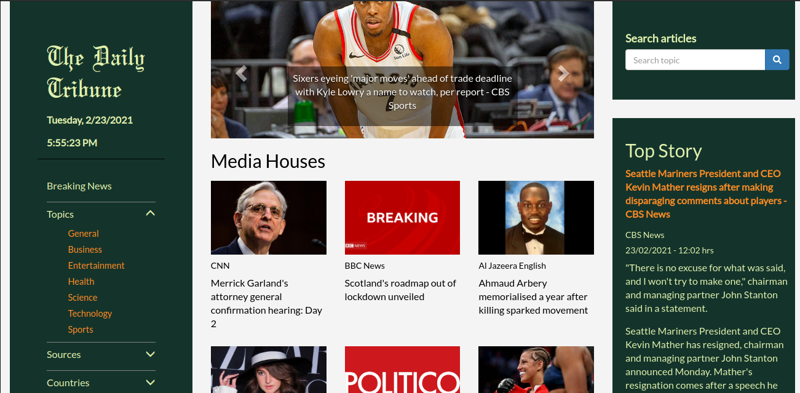

# The Daily Tribune
#### An news app that allows users to preview and browse news articles from around the world, 2/22/2021
#### By [Ryan Rotich](https://github.com/RYAN2540)
## Description

<table>
<tr>
<td>
The Daily Tribune is a news app that allows users to preview news stories from around the world, get breaking news, search trending topics, and explore top media houses. It consumes data from NEWS API. 

On the app a user is able to explore various news categories including breaking news, business, sports among others. Users can also check out news articles from specific media houses, and from specific countries. One is able to search topics from around the globe, and for a more refined search, find articles from specific media houses. The app gives the time an article was posted, its source and author, and a brief content description. Tap on article links to read full articles on the source websites.
</td>
</tr>
</table> 

#### Latest updated version is on 23rd Feb 2021.

## Technologies used

1. Python v3.9
2. Flask 1.1.2
3. JavaScript
4. Flask-Bootstrap
5. HTML & CSS

## Development

The app has been developed with Flask 1.1.2 and deployed to Heroku. It's source code is available on GitHub at run ./start.sh

To contribute to this project on any modules, follow these easy steps:

- Fork the repo
- Create a new branch in your terminal (git checkout -b improve-feature)
- Make appropriate changes in file(s)
- Add the changes and commit them (git commit -am "Improve App")
- Push to the branch (git push origin improve-app)
- Create a Pull request

## Support and contact details
For any queries, issues, ideas or concerns contact [Ryan Rotich](austinbrian005@gmail.com). Your feedback is highly appreciated. 
### [License](LICENSE)
MIT license
Copyright (c) 2021 **Ryan Rotich**